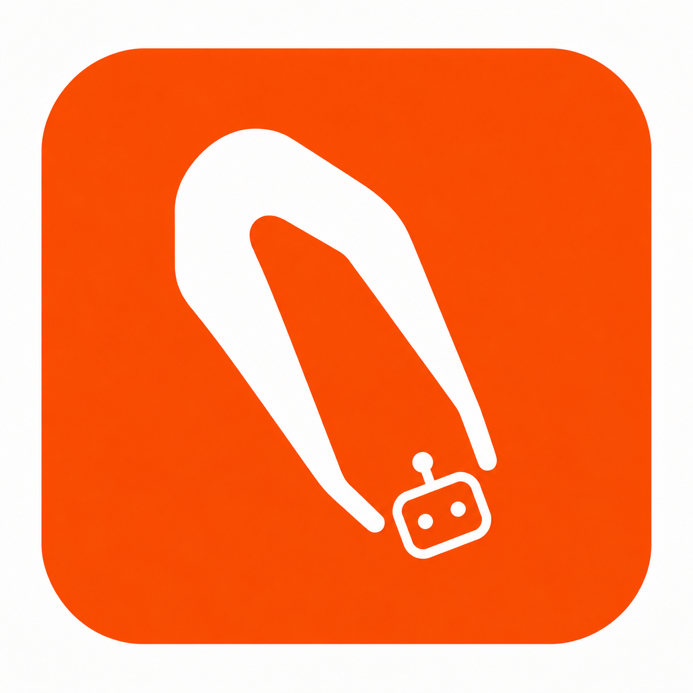

# nitpick

AI code review for AI agents.

`nitpick` sends your git diff, the full changed files, and the parts of the repo that matter for judging the change to a model on [OpenRouter](https://openrouter.ai) (or a local Ollama / llama.cpp server), and prints structured findings. It exits `1` when there are findings at or above a severity you choose, so a coding agent can run it before opening a PR and loop until the review is clean.

No GitHub Action, no waiting for CI. The agent that wrote the code gets a second opinion from a different model in one command. Or in no command at all: `nitpick watch` plugs into the agent's hooks and reviews each batch of edits in the background while the agent keeps working ([details](#watch-review-while-the-agent-works)).

```
$ nitpick
nitpick: working tree vs merge-base with main (3f1c2a9) · 2 file(s) · ~7.8k tokens context (6 snippets, 0 dropped, 175ms) · stealth/space-bunny-alpha via openrouter
nitpick: stealth/space-bunny-alpha done in 41.2s, 2 finding(s)
# nitpick: request changes

`working tree vs merge-base with main (3f1c2a9)` · branch `fix-ranges` · head `9e21be5` · 2 file(s) · ~7.8k tokens of context · 1/1 model(s) · 41.4s

**stealth/space-bunny-alpha** (request changes, 41.2s): Two small changes, both regressions. ...

## Findings (2)

### High

- **src/diff.rs:62** new_ranges now returns an exclusive end `[bug]`
  The doc comment and both callers treat the range as inclusive; `windowed_listing` slices `lines[..e]` and will panic on the last hunk of a file.
  Suggestion: restore `h.new_start + h.new_len - 1`.
- **src/search.rs:132** path_stem returns the extension instead of the stem `[bug]`
  `rsplit('.').next()` yields the text after the last dot. `context.rs:441` uses this to match test files, so no tests will ever be pulled into context.

2 finding(s) at or above `high`. Exit code 1.
```

## Install

```bash
brew install LVTD-LLC/tap/nitpick
```

Or from source, with Rust 1.98 or newer:

```bash
cargo install --git https://github.com/LVTD-LLC/nitpick
```

Both build from source; the binary is a single static executable.

## Setup

Set an OpenRouter key:

```bash
export NITPICK_OPENROUTER_API_KEY=sk-or-...
```

`OPENROUTER_API_KEY` also works. That is all that is required. Optionally write a config file into the repo:

```bash
nitpick init
```

## Usage

```
nitpick                          # review working tree vs merge-base with main (auto-detected)
nitpick --staged                 # only what is staged
nitpick --base develop           # diff against a different branch
nitpick --range main..HEAD       # explicit revision range
nitpick src/api/                 # limit to some paths
nitpick -m openai/gpt-5.5 -m anthropic/claude-opus-5-5   # several models in parallel, findings merged
nitpick -f "Focus on the SQL; we had injection bugs here before."
nitpick --json                   # machine-readable output
nitpick --fail-on medium         # stricter exit code
nitpick context                  # print exactly what would be sent, without calling a model
```

What gets diffed, in order of precedence: `--range`, `--staged`, `--base`, then auto-detect. Auto-detect compares the working tree (including untracked files) against the merge-base with `origin/HEAD`, `main`, or `master`. On the default branch itself, it compares against the upstream if the branch has diverged, otherwise against `HEAD`.

### Exit codes

| code | meaning |
|---|---|
| 0 | no findings at or above `--fail-on` (default `high`) |
| 1 | findings at or above `--fail-on` |
| 2 | error: no model answered, git failed, bad config |

### For agents

The [nitpick-skills](https://github.com/LVTD-LLC/nitpick-skills) repo packages a skill and plugin for Claude Code, Codex, Cursor, OpenClaw, OpenCode, and any Agent Skills client. The plugin ships the watch hooks (below) and a skill that teaches the agent to install nitpick, run it before a PR, and loop on findings:

```bash
claude plugin marketplace add LVTD-LLC/nitpick-skills && claude plugin install nitpick@nitpick-skills
codex plugin marketplace add LVTD-LLC/nitpick-skills && codex plugin add nitpick@nitpick-skills
```

Without a plugin system, add something like this to your `CLAUDE.md` or `AGENTS.md`:

```
Before opening a PR, run `nitpick` from the repo root. Fix every finding at
severity high or blocker, then run it again until it exits 0. Findings at
medium or below are judgment calls; address or explain them in the PR.
```

`nitpick` prints progress on stderr and the review on stdout. Findings cite `path:line` in the post-change file. With `--json` you get the same data as an object with `verdict`, `findings[]`, per-model summaries, token counts and cost.

## Watch: review while the agent works

`nitpick watch` turns the review into something the agent never has to think about. The agent's harness already fires a hook after every tool call and when the agent wants to finish; nitpick hooks into those, and the agent only hears from it when something was found.

```bash
nitpick watch install claude        # Claude Code: .claude/settings.json in this repo
nitpick watch install codex         # Codex: .codex/hooks.json (then trust it with /hooks in Codex)
nitpick watch install cursor        # Cursor: .cursor/hooks.json
nitpick watch install pi            # pi: .pi/extensions/nitpick.ts
nitpick watch install opencode      # OpenCode: .opencode/plugins/nitpick.ts
nitpick watch install openclaw      # OpenClaw: .openclaw/extensions/nitpick/
nitpick watch install claude --global   # for every repo instead of this one
```

The Claude Code and Codex plugins from nitpick-skills carry the same hooks, so installing the plugin is enough there.

How it works:

1. **Session start**: the current working tree becomes the baseline, so your own uncommitted work is never blamed on the agent.
2. **After each tool call**: the hook records that something happened and, if no worker is running, starts one in the background. It returns in a few milliseconds; the agent is not slowed down.
3. **The worker** waits for the edits to go quiet (`debounce_secs`, default 20), then diffs every changed file against the copy it reviewed last time. That small diff goes through the same context engine and model call as a normal review, with extra instructions that this is work in progress: no complaints about TODOs, missing tests, or code that is not written yet. Findings at or above `deliver` (default medium) are queued.
4. **The next hook** hands the queued findings to the agent as a `[nitpick]` note: file, line, what is wrong, a suggested fix, and a reminder that it is a second opinion worth verifying. In Claude Code and Codex this arrives right after the agent's next tool call; in Cursor after the next tool call too; in pi it is appended to the tool result; in OpenCode and OpenClaw it is added to the next prompt.
5. **When the agent wants to finish**, the stop hook waits for any review in flight, reviews whatever is still unreviewed, and if anything is at or above `fail_on` (default high) sends the agent back with the findings. It does this at most `max_stop_blocks` times in a row (default 2) so a stubborn disagreement cannot loop forever; after that it lets the agent stop and tells you.

Provider errors are logged and swallowed. A review that could not run is not a failed review; after three failures in a row the pending changes are written off so a dead free model cannot queue the same diff forever. Everything lives under `.git/nitpick/` in the checkout (per worktree), which git ignores. Nothing is sent anywhere except the model provider you configured.

```bash
nitpick watch status     # on or off, worker state, what is waiting to be reviewed, recent activity
nitpick watch log        # findings of past background reviews, newest first
nitpick watch run        # review everything unreviewed right now, in the foreground
nitpick watch reset      # forget baselines and queued findings
nitpick watch show codex # print the hook definitions without installing them
NITPICK_WATCH=0 claude   # turn it off for one session
```

Configure it in `.nitpick.toml`:

```toml
[watch]
# enabled = true
model = "nvidia/nemotron-3-ultra-550b-a55b:free"   # a cheaper or free model for the many small reviews
deliver = "medium"      # lowest severity handed to the agent mid-task
# fail_on = "high"      # lowest severity that sends the agent back when it tries to stop (defaults to the top-level fail_on)
debounce_secs = 20
max_wait_secs = 120     # review anyway once edits have been arriving for this long
timeout_secs = 180
# budget_tokens = 40000
# stop_wait_secs = 120  # how long the stop hook waits for a review in flight
# max_stop_blocks = 2
# instructions = "Extra instructions for the background reviewer only."
```

Free OpenRouter models are rate limited per minute and per day; the debounce is what keeps a busy session inside those limits. If the agent is launched from a GUI where your shell environment is not available, put the key in `~/.config/nitpick/config.toml` as `api_key = "sk-or-..."` (that file is read for every repo; `api_key` is ignored in a repo's `.nitpick.toml` on purpose).

### Other harnesses

`nitpick hook generic <event> --cwd <repo> [--tool <name>]` is the integration point for anything else. Events are `session-start`, `tool`, `prompt` and `stop`. It prints one JSON object:

```json
{"event":"stop","context":null,"block":true,"reason":"[nitpick] A background review ...","note":null}
```

`context` is text to put in front of the model, `block` with `reason` means the agent should do one more pass with `reason` as its input, and `note` is for the human. The pi, OpenCode and OpenClaw shims (`nitpick watch show pi` prints one) are thirty-line examples of wiring this into an extension API.

## What gets sent

1. The unified diff.
2. The full post-change content of each changed file, numbered. Files over `max_file_lines` are windowed around the changed lines. Brand-new files are sent once, as a listing, not twice.
3. Related context, all of it unchanged code, each piece labeled with why it is there:
   - definitions of symbols the diff references (tree-sitter for TypeScript, TSX, JavaScript, Python, Rust and Go; regex elsewhere)
   - call sites of symbols the diff changed
   - modules the changed files import (outlined if large)
   - the list of files that import each changed file
   - tests that match each changed file

Context is ranked and trimmed to `budget_tokens` (default 80,000). `nitpick context` shows the exact payload.

Search uses the same crates as ripgrep and respects `.gitignore`. Nothing leaves your machine except the request to the model provider you configured.

## Configuration

`.nitpick.toml` in the repo root. Every key is optional. Flags and `NITPICK_*` environment variables override it.

```toml
model = ["stealth/space-bunny-alpha", "nvidia/nemotron-3-ultra-550b-a55b:free"]
provider = "openrouter"        # openrouter | ollama | llamacpp | openai
# base_url = "http://localhost:11434/v1"
# api_key_env = "NITPICK_OPENROUTER_API_KEY"
# base = "main"
fail_on = "high"                # blocker | high | medium | low | nit
budget_tokens = 80000
max_file_lines = 400
max_tokens = 16000              # completion budget; doubled automatically if the model runs out
# reasoning = "medium"          # none | low | medium | high, for models that support it
# timeout_secs = 300
ignore = ["**/*.lock", "**/generated/**"]
instructions = """
This is a Django app. Be strict about N+1 queries and missing select_related.
Ignore anything about docstrings.
"""

[watch]                         # background review; see above
deliver = "medium"
debounce_secs = 20
```

A user-level `~/.config/nitpick/config.toml` with the same keys is read first and the repo file layered over it.

Environment variables: `NITPICK_MODEL`, `NITPICK_PROVIDER`, `NITPICK_BASE_URL`, `NITPICK_API_KEY`, `NITPICK_REASONING`, `NITPICK_OPENROUTER_API_KEY`, `OPENROUTER_API_KEY`, `NITPICK_OPENAI_API_KEY`, `OPENAI_API_KEY`, `NITPICK_WATCH=0`.

### Local models

Any OpenAI-compatible server works. Ollama and llama.cpp have presets:

```bash
nitpick --provider ollama -m qwen3-coder:30b
nitpick --provider llamacpp -m whatever-the-server-loaded
nitpick --provider openai --base-url http://localhost:1234/v1 -m local-model   # LM Studio, vLLM, etc.
```

No API key is required for `ollama` and `llamacpp`. Structured output is requested when the server supports it and the response is parsed leniently either way, so smaller models that wrap JSON in prose or use slightly different field names still work.

### Multiple models

Pass `-m` more than once (or a list in the config). Models run in parallel. Findings that agree (same file, nearby lines, similar title) are merged and shown as `(2/3 models)`, which is a useful confidence signal. The overall verdict is derived from the merged findings, not from any single model.

## Debugging

`NITPICK_DEBUG_DIR=/tmp/nitpick-debug nitpick -v` writes every request and raw response to that directory.

## Development

```bash
cargo fmt --all -- --check
cargo clippy --all-targets -- -D warnings
cargo test
cargo build --release
./target/release/nitpick context     # dogfood on your own changes
```

There is no CI; run the checks above locally before committing. `AGENTS.md` has the full guide for coding agents working on this repo.

The crate is organized as: `git` (shelling out to git), `diff` (unified diff parser), `lang` (tree-sitter and import extraction), `search` (ripgrep crates), `context` (the pack builder and budget), `prompt`, `llm` (OpenAI-compatible client with fallbacks), `review` (schema, lenient parsing, merging, rendering), `run` (settings and the model loop shared by review and watch), `watch` (baselines, worker, inbox, stop logic), `hooks` (per-harness adapters and `watch install`), `config`, `main`.

## License

MIT
